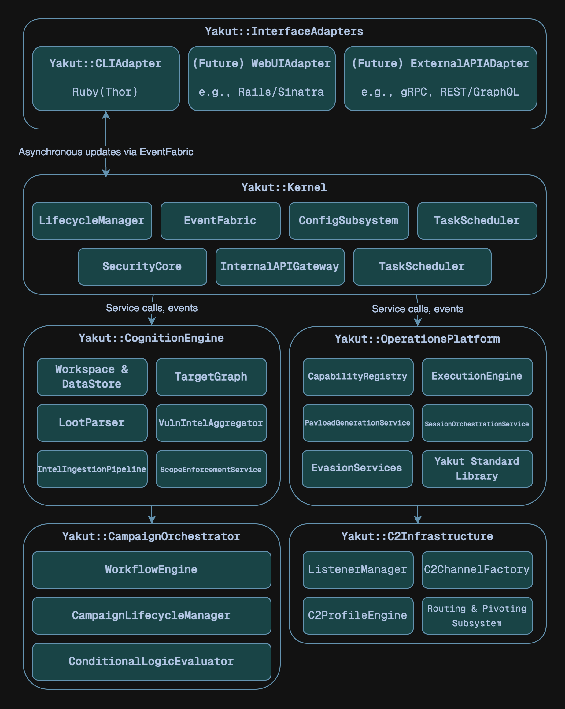

# Architectural Overview

Understanding the high-level architecture of Yakut is crucial for both module developers
and those wishing to contribute to its core. Yakut is designed as a collection of
interconnected, yet largely independent, components that work together to provide a
comprehensive penetration testing environment.

## 1. Core Architectural Tenets

- Function-centric microservices-inspired design
- Intelligence-driven operations
- Layered extensibility
  - Capabilities
  - Core services
  - Interface adapters
- API-first principle
- Asynchronous & event-driven paradigm

## 2. High-Level Component Diagram

## 3. Detailed Component Breakdown

### 3.1. `Yakut::Kernel`

The Kernel is the immutable core. It provides the fundational runtime and system-level services. It does not contain business logic related to penetration testing itself but enables all other components.

- `LifecycleManager`: Manages the boot sequence (dependency injection, service initialization order), health checks of core services and coordinated shutdown.
- `EventFabric`: Facilitates asynchronous, decoupled communication via a publish-subscribe model.
- `ConfigSubsystem`: Loads, merges and provides access to configurations from files.
- `LoggingSubsystem`: Provides a centralized and structured logging facility.
- `TaskScheduler`: Manages the execution of asynchronous tasks, primarily capability runs initiated with `--async`.
- `InternalAPIGateway`: Acts as a unified, versioned Facade for all core framework services. This is the _sole entry point_ for `InterfaceAdapters` and for structured inter-component API calls. It exposes well-defined Ruby methods. Handles request routing to the appropriate Engine/Platform, basic request validation and API versioning. Not an HTTP gateway.
- `SecurityCore`: Manages framework security aspects, primarily focused on secure secret maangement.

### 3.2. `Yakut::CognitionEngine`

The data and intelligence hub, transforms raw data into a structured understanding of the engagement.

- `Workspace & DataStore Management`: Manages Workspace lifecycle and data persistence.
- `TargetGraph`: Represents targets and their interconnections as a graph.
- `LootParserFramework`: Ingests and parses various types of loot.
- `VulnIntelAggregator`: Aggregates and enriches vulnerability data.
- `IntelIngestionPipeline`: Processes data from `Intel` capabilities and external feeds.
- `ScopeEnforcementService`: Checks if a proposed action/target is within the defined Workspace scope.

### 3.3. `Yakut::OperationsPlatform`

The engine for executing all active offensive, defensive and utility capabilities.

- `CapabilityRegistry`: Discovers, loads, validates, and manages capabilities.
- `ExecutionEngine`: Provides the runtime environment for executing `check`, `run` and `cleanup` methods of capabilities.
- `PayloadGenerationService`: Generates and configures payloads.
- `SessionOrchestrationService`: Manages the logical state and interaction API for active C2 sessions.
- `EvasionServices`: Provides on-demand evasion techniques. It is a collection of Ruby classes/modules implementing various obfuscation, encoding, process injection or anti-analysis techniques.
- `YSL (Yakut Standard Library)`: A curated set of Ruby mixins, utility classes, and functions provided to capability developers.

### 3.4. `Yakut::C2Infrastructure`

Manages the network communication aspects of Command and Control.

- `ListenerManager`: Binds to network ports and accepts incoming connections for various C2 protocols.
- `C2ChannelFactory`: Creates and manages instances of specific C2 communication channels based on listener type and payload configuration.
- `C2ProfileEngine`: Applies malleable C2 profiles to active listeners and channels.
- `Routing & Pivoting Subsystem`: Manages network routes through compromised hosts (pivots). Interacts with active YakutAgent sessions to set up SOCKS proxies or port forwards on compromised hosts. Maintains an internal routing table that other Capabilities can use to direct their traffic through pivots. May involve low-level packet manipulation or dynamic proxying logic.

### 3.5. `Yakut::CampaignOrchestrator`

The strategic automation engine for complex, multi-stage operations.

- `WorkflowEngine`: Executes `Orchestration` capabilities.
- `CampaignLifecycleManager`: Manages the overall lifecycle of defined Campaigns (objectives, status, associated Workspaces, timelines).
- `ConditionalLogicEvaluator`: Evaluates conditions within orchestration workflows.

### 3.6. `Yakut::InterfaceAdapters`

Provides external interfaces to the Yakut ecosystem.

- `Yakut::CLIAdapter` (`yakut-console`): The primary interactive command-line interface.
- (Future) `Yakut::WebUIAdapter`: Could be a Ruby web framework (Rails, Sinatra, ...) application that communicates with the `Yakut::Kernel` via the `InternalAPIGateway`.
- (Future) `Yakut::ExternalAPIAdapter`: Could expose a RESTful (e.g., using Grape or Rails API) or gRPC interface. Requests would be authenticated and then translated into calls to the `InternalAPIGateway`.

## 4. Data Flow & Interaction Patterns

- **Synchronous control flow:** User commands from the `CLIAdapter` typically result in synchronous calls through the `InternalAPIGateway` to components like `OperationsPlatform` (to run a Capability) or `CognitionEngine` (to query data).
- **Asynchronous event flow:** Discoveries (new hosts, vulns, loot) or state changes (session opened, job completed) are published as events on the `EventFabric`. Other components subscribe to these events to react appropriately (e.g., `CognitionEngine` updates its DataStore, `CLIAdapter` shows a notification).

### 4.1. Capability Execution Lifecycle

1. User selects and configures a Capability via `CLIAdapter`.
2. `CLIAdapter` requests `OperationsPlatform` to execute the Capability.
3. `OperationsPlatform::ExecutionEngine` instantiates the Capability, injects options and YSL access.
4. Capability code runs, using YSL and internal APIs to interact with targets, generate payloads (via `PayloadGenerationService`), report loot/vulns (to `CognitionEngine`) and log messages (to `LoggingSubsystem`).
5. Results and status are returned to `OperationsPlatform`, which then publishes completion events and returns structured output to the `CLIAdapter`.
